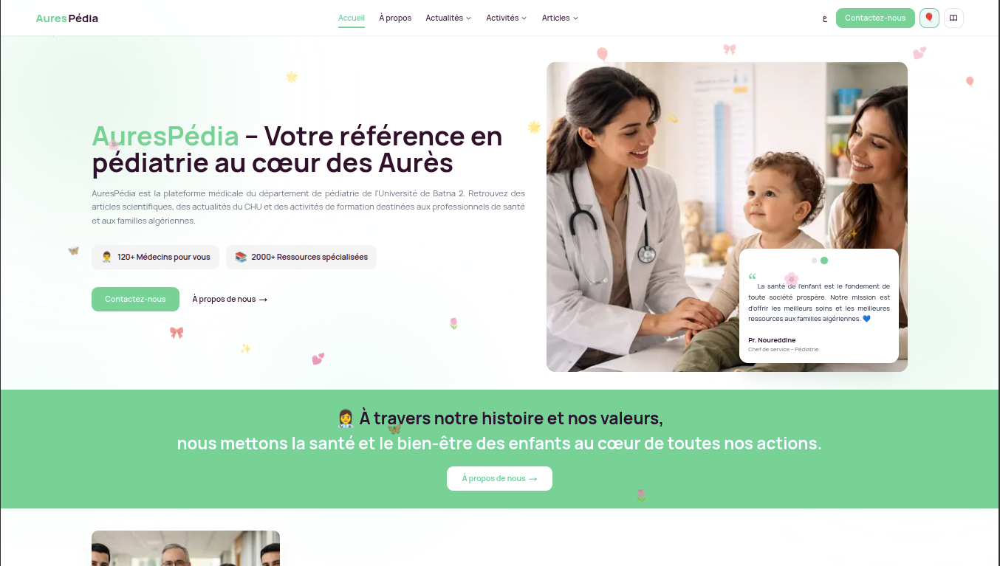
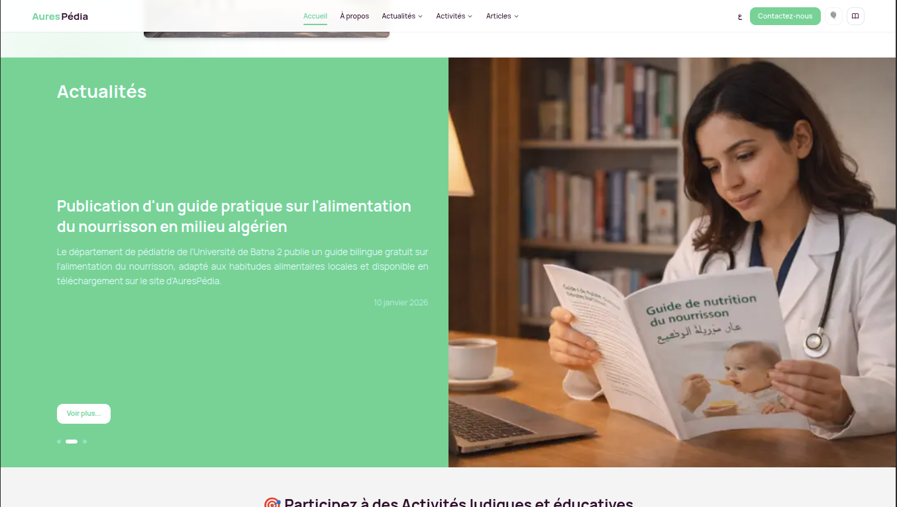
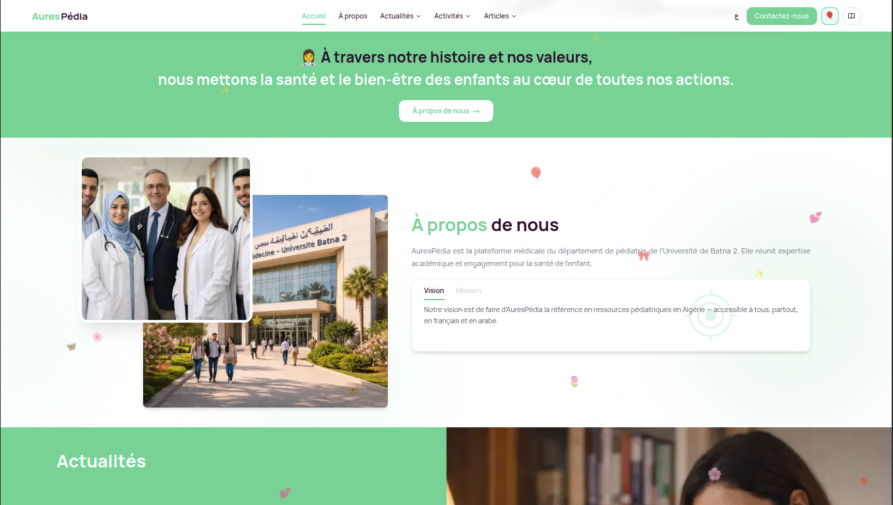
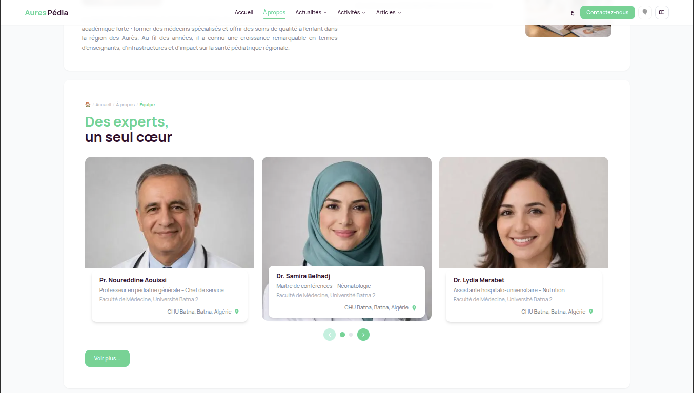

# AuresPédia — Pediatric Medicine Platform

> A bilingual medical web platform built for the Pediatrics Department of the University of Batna 2, Algeria. Designed to bridge the gap between academic medical knowledge and Algerian families — in both French and Arabic.

---

## Overview



AuresPédia is a full-stack content-driven web application serving as the official digital presence of the CHU Batna 2 pediatrics department. It provides medical articles, department news, event listings, team profiles, and a contact channel — all in a clean, professional interface optimized for both LTR (French) and RTL (Arabic) reading.

This project was designed and built from the ground up — architecture, UI, content model, and deployment — as a solo engineering effort.

---

## Features

- **Bilingual (FR / AR)** with full RTL layout support — not just translated text, but a completely mirrored UI
- **Content Management** via Sanity.io — doctors and staff manage articles, news, and events without touching code
- **Medical articles** with rich text, categories, authors, and images
- **Department news & events** with upcoming/past activity separation
- **Team profiles** for faculty and medical staff
- **Contact form** powered by Resend for reliable email delivery
- **Animated landing page** — ambient background orbs + floating emoji layer with a navbar toggle
- **Static generation** — all 16 pages pre-rendered at build time for near-instant load

---

## Tech Stack

| Layer | Technology |
|---|---|
| Framework | Next.js 14 (App Router) |
| Styling | Tailwind CSS |
| i18n | next-intl (fr / ar, RTL) |
| CMS | Sanity.io |
| Email | Resend |
| Fonts | Manrope (FR) · Cairo (AR) |
| Deployment | Vercel |

---

## Screenshots

### Landing Page


---

### Medical Actualities


---

### Department Activities


---

### Team Section



---

### Mobile View (Arabic / RTL)
<!-- 📸 PLACE SCREENSHOT: Mobile screen showing RTL Arabic layout -->
> `screenshots/mobile-ar.png`

---

### Sanity Studio (CMS)


---

## Architecture

```
app/
├── [locale]/               # All pages scoped by locale (fr | ar)
│   ├── page.jsx            # Landing page
│   ├── a-propos/           # About + contact
│   ├── articles/           # Medical articles + slug pages
│   ├── actualites/         # Department news
│   ├── activites/          # Events (upcoming + past)
│   └── ressources/         # Resources library
├── api/
│   └── contact/            # Resend email endpoint
└── studio/                 # Embedded Sanity Studio

components/                 # 20+ shared UI components
messages/                   # fr.json + ar.json translation files
lib/
└── sanity.js               # Typed fetch helpers with safe guards
```

The app uses **static generation** (`generateStaticParams`) for all locale/page combinations. Sanity fetches are wrapped in a `safeFetch` guard that returns empty arrays when credentials are absent — so the build never breaks in CI or during local development without a `.env.local`.

---

## Internationalization

RTL support goes beyond flipping text direction. The entire layout mirrors: navigation alignment, padding directions, animation slide directions, font stacks, and component-level flex ordering all adapt based on locale. Arabic uses the Cairo typeface; French uses Manrope.

```js
// Locale detection + static params
export function generateStaticParams() {
  return [{ locale: 'fr' }, { locale: 'ar' }]
}
```

---

## Content Model (Sanity)

Five schemas drive the platform:

- **`article`** — title, slug, body (portable text), author, category, image
- **`actualite`** — department news with date and featured image
- **`activite`** — events with date, type (upcoming/past), and description
- **`teamMember`** — name, role, photo, bio
- **`siteConfig`** — hero content, vision, mission, quotes — editable without a redeploy

---

## Getting Started

```bash
git clone https://github.com/Alaeddine-Nasri/AuresPedia.git
cd AuresPedia
npm install
```

Create a `.env.local` file:

```env
NEXT_PUBLIC_SANITY_PROJECT_ID=your_project_id
NEXT_PUBLIC_SANITY_DATASET=production
SANITY_API_TOKEN=your_token
RESEND_API_KEY=your_resend_key
NEXT_PUBLIC_SITE_URL=http://localhost:3000
```

```bash
npm run dev
```

Open [http://localhost:3000/fr](http://localhost:3000/fr) — or `/ar` for the Arabic version.

---

## Deployment

Deployed on **Vercel** with automatic builds on every push to `main`. Environment variables are configured in the Vercel dashboard. The embedded Sanity Studio is accessible at `/studio`.

---

## About the Project

This platform was built for the CHU Batna 2 pediatrics faculty to give them a real digital presence — something that reflects the seriousness of their academic work while being genuinely accessible to Algerian families searching for reliable medical information about child health.

It was an opportunity to work on a project with real stakeholders, real content requirements, and real constraints — bilingual medical content, institutional branding, and a team that needed to manage their own content without developer involvement.

---

*Built by [Ala Eddine Nasri](https://github.com/Alaeddine-Nasri)*
